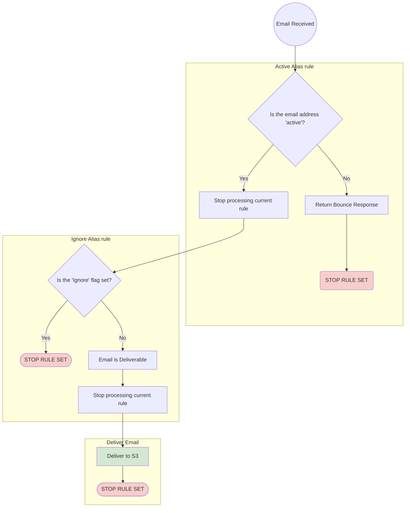

# mikesoh.com Deployments

## ec2/networking/rds 

More to come.

## SES

[Understanding AWS's SES Receive Rules concepts](https://docs.aws.amazon.com/ses/latest/dg/receiving-email-concepts.html) are critical to understanding how the rule-set works.  There are a total of three rules within the rule-set the define how an email is routed.

The rule-set provides an initial "deny".  Once delivered to S3, a lambda then pipes to [procmail](https://manpages.ubuntu.com/manpages/trusty/man1/procmail.1.html) for further processing.  At that point, emails are not bounced using SES's native bounce template.

